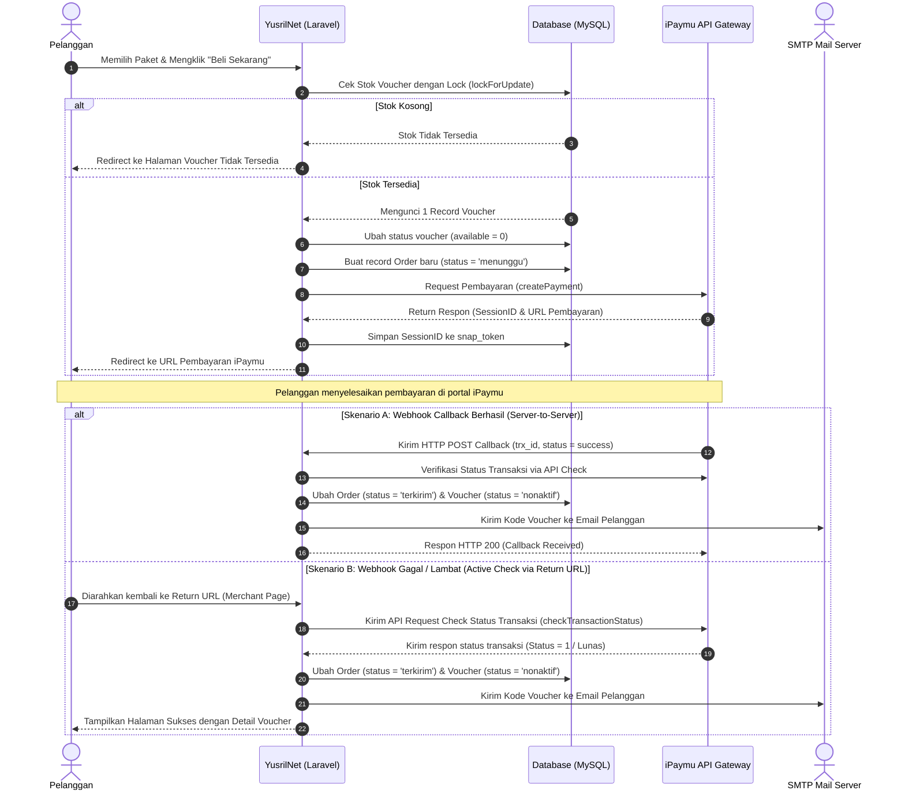

# Product Requirement Document (PRD)
## Project Name: YusrilNet - WiFi Voucher Management System
**Author:** Senior Full Stack Developer & System Analyst  
**Version:** 1.0.0  
**Status:** Approved  
**Date:** June 15, 2026  

---

## 1. Executive Summary

### 1.1. Latar Belakang
Dalam penyediaan layanan internet nirkabel (WiFi) berbayar di tingkat lokal (seperti RT/RW Net atau kafe), pengelolaan voucher secara manual sering kali menjadi hambatan operasional. Proses pembuatan voucher, pencatatan transaksi, distribusi kode voucher kepada pelanggan, dan rekonsiliasi pembayaran secara manual rentan terhadap kesalahan manusia (*human error*) dan memiliki skalabilitas yang sangat terbatas.

**YusrilNet** dirancang sebagai solusi otomatisasi sistem manajemen WiFi Voucher berbasis web. Sistem ini menggabungkan antarmuka admin yang modern dengan jalur pembelian mandiri (*self-service*) bagi pelanggan umum yang terintegrasi secara *real-time* dengan gerbang pembayaran elektronik (*payment gateway*). Dengan sistem ini, pengelola hotspot dapat menghemat waktu operasional dan mengurangi risiko kebocoran pendapatan.

### 1.2. Visi Produk
Menjadi platform manajemen voucher WiFi mandiri yang efisien, aman, dan mudah digunakan bagi penyedia jasa internet skala kecil hingga menengah (ISP Lokal, RT/RW Net, Kafe, dan Co-working Space).

---

## 2. Tujuan & Matrik Keberhasilan (Objectives & Key Results)

| Objective | Key Results (KPI) |
| :--- | :--- |
| **Otomatisasi Pembelian** | Mengurangi waktu interaksi admin dengan pembeli hingga 95% lewat sistem *self-service*. |
| **Keamanan Transaksi** | Menjamin 100% voucher yang terjual dikirim secara unik dan mencegah *double-selling* menggunakan *database lock*. |
| **Kemudahan Administrasi** | Memfasilitasi admin untuk mengimpor dan mengekspor data voucher dalam format Excel < 5 detik untuk 5.000+ data. |
| **Keandalan Sistem** | Memastikan sistem *callback* pembayaran tetap sinkron meskipun koneksi terputus dengan verifikasi *active check*. |

---

## 3. Analisis Pengguna & Persona

### 3.1. Persona 1: Admin / Pemilik Hotspot (Operator)
*   **Profil:** Pengelola jaringan RT/RW Net atau pemilik kafe yang memiliki pengetahuan teknis dasar tentang jaringan MikroTik.
*   **Tujuan:**
    *   Mengunggah dan membuat daftar kode voucher dalam jumlah besar secara cepat.
    *   Melihat laporan pendapatan harian, mingguan, dan bulanan.
    *   Memantau paket mana yang paling diminati oleh pelanggan.
*   **Poin Frustrasi:**
    *   Harus melayani pembeli voucher secara manual di malam hari.
    *   Kesulitan mencatat pembukuan keuangan dari penjualan voucher.

### 3.2. Persona 2: Pelanggan Hotspot (Public User)
*   **Profil:** Mahasiswa, pekerja lepas, atau warga sekitar hotspot yang membutuhkan koneksi internet berbayar dengan cepat.
*   **Tujuan:**
    *   Membeli voucher WiFi kapan saja (24/7) tanpa harus mencari admin secara fisik.
    *   Mendapatkan kode voucher secara langsung setelah pembayaran berhasil.
    *   Melakukan pembayaran dengan metode yang bervariasi (QRIS, E-Wallet, Virtual Account).
*   **Poin Frustrasi:**
    *   Sudah membayar tetapi kode voucher lambat dikirimkan.
    *   Proses checkout yang rumit dan lambat di perangkat seluler.

---

## 4. Arsitektur Teknis & Dependensi

Sistem dibangun menggunakan arsitektur MVC (Model-View-Controller) monolitik modern yang memanfaatkan framework Laravel untuk logika backend dan Bootstrap 5 yang dipadukan dengan Vite untuk frontend.

```
+-----------------------------------------------------------+
|                      CLIENT BROWSER                       |
|               (Bootstrap 5 + Custom CSS)                  |
+-----------------------------+-----------------------------+
                              | HTTP Requests
                              v
+-----------------------------+-----------------------------+
|                      LARAVEL 11 FRAMEWORK                 |
|                                                           |
|  +----------------------+       +----------------------+  |
|  |   Public Controllers |       |  Admin Controllers   |  |
|  | (PublicOrderController)|     | (VoucherController)  |  |
|  +----------+-----------+       +----------+-----------+  |
|             |                              |              |
|             v                              v              |
|  +-----------------------------------------------------+  |
|  |                     Eloquent ORM                    |  |
|  +-----------------------------------------------------+  |
+-----------------------------+-----------------------------+
                              | SQL Queries
                              v
+-----------------------------+-----------------------------+
|                      DATABASE (MySQL)                     |
+-----------------------------------------------------------+
```

### 4.1. Spesifikasi Stack
*   **Backend Framework:** Laravel 11.x (PHP 8.2+)
*   **Database:** MySQL 5.7 / 8.0+
*   **Frontend Engine:** Blade Templating + Bootstrap 5.3 + Font Awesome 6
*   **Build Tool:** Vite
*   **Modul Eksternal Utama:**
    *   `iPaymu SDK / API Integration` (Gerbang Pembayaran)
    *   `Maatwebsite Excel` (Impor/Ekspor data Voucher)
    *   `Laravel Breeze` (Autentikasi dasar admin)
    *   `Barryvdh DomPDF` (Mencetak laporan order PDF)

---

## 5. Fitur Utama & Kebutuhan Fungsional (Functional Requirements)

### 5.1. Modul Publik (Public Interface)

#### FR-1.1: Landing Page & Katalog Paket
*   **Deskripsi:** Halaman utama menampilkan daftar paket internet aktif yang ditawarkan oleh penyedia WiFi.
*   **Detail Kebutuhan:**
    *   Menampilkan kartu nama paket (contoh: "Paket Hemat 3 Jam", "Paket Gaming 24 Jam").
    *   Menampilkan informasi harga, durasi, dan deskripsi singkat.
    *   Tombol "Beli Sekarang" hanya muncul jika stok voucher untuk paket tersebut tersedia (`available > 0`). Jika habis, sistem akan menampilkan badge "Habis".
    *   Desain responsif (mobile-first) agar mudah diakses langsung lewat portal penangkap (*captive portal*) WiFi di HP.

#### FR-1.2: Sistem Checkout Mandiri
*   **Deskripsi:** Pelanggan mengisi data pemesanan sebelum diarahkan ke gerbang pembayaran.
*   **Detail Kebutuhan:**
    *   Formulir input wajib mengisi: Nama Lengkap, Alamat Email (untuk pengiriman voucher), dan Nomor WhatsApp/Telepon (opsional).
    *   Sistem melakukan verifikasi stok voucher secara *real-time* saat tombol beli ditekan menggunakan mekanisme **Database Lock** (`lockForUpdate()`) guna menghindari *race condition* (dua orang membeli voucher terakhir secara bersamaan).
    *   Mengurangi status ketersediaan voucher sementara (`available = 0`) selama transaksi berstatus menunggu pembayaran.

#### FR-1.3: Integrasi Pembayaran iPaymu
*   **Deskripsi:** Pembayaran otomatis menggunakan layanan pihak ketiga iPaymu.
*   **Detail Kebutuhan:**
    *   Mengirim data detail pesanan (nama produk, kuantitas, harga, dan informasi pembeli) ke API iPaymu.
    *   Menyediakan *Return URL* (untuk pengalihan pembeli kembali ke web setelah membayar), *Cancel URL* (jika transaksi dibatalkan), dan *Notify/Callback URL* (untuk notifikasi sinkronisasi antar server).
    *   Menangani perubahan status transaksi dari iPaymu secara asinkron (*webhook callback*).
    *   Menerapkan *Active Check Status* pada halaman return untuk mengantisipasi kegagalan webhook dari iPaymu (sangat penting untuk lingkungan localhost yang tidak bisa dijangkau webhook eksternal).

#### FR-1.4: Pengiriman Voucher Otomatis (Email & Layar)
*   **Deskripsi:** Penyerahan kode voucher ke pelanggan segera setelah status pembayaran diverifikasi Lunas (`terkirim` / `success`).
*   **Detail Kebutuhan:**
    *   Menampilkan halaman sukses berisi nama paket, durasi, *username*, *password*, dan petunjuk login hotspot.
    *   Mengirim notifikasi email berisi detail voucher menggunakan `Mail::to()->send()` dengan template surat elektronik yang responsif (`VoucherCodeMail`).

---

### 5.2. Modul Admin Panel (Admin Console)

#### FR-2.1: Dasbor Statistik & Analitik
*   **Deskripsi:** Ringkasan operasional sistem dalam bentuk grafik dan metrik.
*   **Detail Kebutuhan:**
    *   Menampilkan total pendapatan, jumlah paket aktif, voucher tersedia, dan jumlah voucher terjual.
    *   Menampilkan daftar 5 transaksi terbaru beserta statusnya.

#### FR-2.2: Pengelolaan Paket (CRUD Paket)
*   **Deskripsi:** Admin dapat membuat, mengubah, melihat, dan menghapus paket internet.
*   **Detail Kebutuhan:**
    *   Atribut paket: Nama Paket, Harga (IDR), Durasi (Jam/Hari), Deskripsi, Detail Fitur (format array JSON), Status Ketersediaan (Aktif / Non-Aktif).
    *   Menghapus paket akan memvalidasi apakah ada voucher aktif terkait.

#### FR-2.3: Inventori Voucher (CRUD & Bulk Actions)
*   **Deskripsi:** Pengelolaan kode voucher yang dihasilkan dari router MikroTik untuk dijual di sistem.
*   **Detail Kebutuhan:**
    *   **Generate Voucher:** Fitur untuk membuat voucher secara instan.
    *   **Import Excel:** Memungkinkan admin mengunggah file Excel berisi ratusan kode voucher sekaligus menggunakan pustaka `Maatwebsite Excel`. Menyediakan tautan unduh template file Excel resmi.
    *   **Export Excel:** Mengunduh data voucher yang terdaftar berdasarkan paket atau status untuk keperluan audit.
    *   **Bulk Delete:** Menghapus data voucher dalam jumlah besar secara cepat (hapus semua, hapus yang dipilih, atau hapus berdasarkan filter paket/status).

#### FR-2.4: Pelacakan & Laporan Transaksi (Orders Management)
*   **Deskripsi:** Pencatatan log transaksi pembelian voucher oleh pelanggan.
*   **Detail Kebutuhan:**
    *   Daftar transaksi dengan pencarian dan filter berdasarkan status (Menunggu, Terkirim, Dibatalkan) dan rentang tanggal.
    *   **Cetak PDF:** Ekspor laporan penjualan ke format file PDF yang siap dicetak untuk pelaporan keuangan.
    *   Pembersihan data transaksi lama secara massal (*bulk delete*).

#### FR-2.5: Manajemen Pengguna & Hak Akses (RBAC)
*   **Deskripsi:** Mengatur akun pengguna yang dapat masuk ke panel admin.
*   **Detail Kebutuhan:**
    *   Membatasi akses Admin Dashboard hanya untuk pengguna dengan peran (`role`) `'admin'`.
    *   Mencegah admin menghapus akunnya sendiri yang sedang aktif digunakan (*Self-deletion protection*).

---

## 6. Desain Basis Data (Database Design)

### 6.1. Entity Relationship Diagram (ERD) & Hubungan Model
*   **`User` (Admin/Staf):** Dapat mengelola banyak `Paket`, `Voucher`, dan `Order`.
*   **`Paket` (Internet Package):** Memiliki hubungan One-to-Many ke `Voucher` (Satu paket memiliki banyak kode voucher) dan One-to-Many ke `Order`.
*   **`Voucher` (Voucher Code):** Berelasi dengan satu `Paket`. Berelasi secara One-to-One opsional dengan `Order` (Satu voucher diasosiasikan ke satu transaksi yang sukses/sedang diproses).
*   **`Order` (Transaction):** Berelasi dengan satu `Paket` dan satu `Voucher` yang dialokasikan.

```
  +--------------+            +--------------+
  |    users     |            |    pakets    |
  +--------------+            +--------------+
  | id (PK)      |            | id (PK)      |
  | name         |            | nama         |
  | email        |            | price        |
  | password     |            | duration     |
  | role         |            | deskripsi    |
  +--------------+            | detail_paket |
                              | available    |
                              | sold         |
                              +------+-------+
                                     |
                                     | 1
                                     |
                                     | 1..*
                              +------v-------+
                              |   vouchers   |
                              +--------------+
                              | id (PK)      |
                              | paket_id(FK) |
                              | nama         |
                              | username     |
                              | password     |
                              | price        |
                              | duration     |
                              | available    |
                              | status       |
                              +------+-------+
                                     |
                                     | 1 (Optional)
                                     |
                                     | 1
                              +------v-------+
                              |    orders    |
                              +--------------+
                              | id (PK)      |
                              | user_id (FK) |
                              | paket_id(FK) |
                              | voucher_idFK|
                              | nama         |
                              | email        |
                              | harga        |
                              | status       |
                              | snap_token   |
                              +--------------+
```

### 6.2. Struktur Tabel Utama

#### Tabel: `pakets`
| Kolom | Tipe Data | Atribut / Keterangan |
| :--- | :--- | :--- |
| `id` | BigInt | Primary Key, Auto Increment |
| `nama` | Varchar(255) | Nama paket internet |
| `price` | Decimal(10,2) | Harga paket |
| `duration` | Varchar(50) | Durasi aktif voucher (misal: "3 Jam", "30 Hari") |
| `deskripsi` | Text | Penjelasan singkat |
| `detail_paket` | JSON | Fitur detail (seperti Kecepatan, FUP, dll) dalam bentuk array |
| `available` | TinyInt(1) | Status aktif/nonaktif di halaman depan (Default: 1) |
| `sold` | Integer | Jumlah akumulasi penjualan voucher |

#### Tabel: `vouchers`
| Kolom | Tipe Data | Atribut / Keterangan |
| :--- | :--- | :--- |
| `id` | BigInt | Primary Key, Auto Increment |
| `paket_id` | BigInt | Foreign Key ke `pakets.id` (Cascade on Delete) |
| `nama` | Varchar(255) | Label / Nama identitas voucher |
| `username` | Varchar(255) | Kredensial username login hotspot |
| `password` | Varchar(255) | Kredensial password login hotspot (opsional jika hanya butuh kode tunggal) |
| `price` | Decimal(10,2) | Salinan harga nominal voucher |
| `duration` | Varchar(50) | Salinan durasi aktif |
| `available` | TinyInt(1) | Ketersediaan di inventory (1 = Ready, 0 = Dipesan/Habis) |
| `status` | Enum | `'aktif'` (siap jual), `'nonaktif'` (sudah terjual) |

#### Tabel: `orders`
| Kolom | Tipe Data | Atribut / Keterangan |
| :--- | :--- | :--- |
| `id` | BigInt | Primary Key, Auto Increment |
| `user_id` | BigInt | Foreign Key ke `users.id` (Nullable, untuk pembeli terdaftar jika ada) |
| `paket_id` | BigInt | Foreign Key ke `pakets.id` |
| `voucher_id` | BigInt | Foreign Key ke `vouchers.id` (Nullable) |
| `nama` | Varchar(255) | Nama pembeli |
| `email` | Varchar(255) | Email pembeli |
| `harga` | Decimal(10,2) | Harga bayar riil saat transaksi |
| `status` | Enum | `'menunggu'`, `'terkirim'`, `'dibatalkan'` |
| `snap_token` | Varchar(255) | Menyimpan SessionID transaksi dari iPaymu |

---

## 7. Desain Sistem & Alur Kerja (User Flow & Sequence)

### 7.1. Alur Pembelian Voucher & Pembayaran (Public Checkout Flow)



---

## 8. Persyaratan Non-Fungsional (Non-Functional Requirements)

### 8.1. Keamanan & Proteksi Data (Security)
*   **CSRF Protection:** Setiap request POST/PUT/DELETE wajib menyertakan token CSRF untuk menghindari eksploitasi keamanan cross-site request forgery.
*   **Sanitisasi Input:** Melakukan validasi tipe data dan penyaringan ketat pada setiap form input guna mencegah celah *SQL Injection* dan *Cross-Site Scripting* (XSS).
*   **Database Transaction & Locking:** 
    *   Pengalokasian voucher wajib menggunakan transaksi database (`DB::transaction`) dikombinasikan dengan Row-Level Lock (`lockForUpdate()`). Hal ini memastikan tidak akan terjadi pengiriman voucher yang sama ke dua pembeli berbeda saat trafik memuncak.
*   **Proteksi Akun:** Akun Admin dilindungi oleh middleware auth Laravel Breeze. Sistem tidak mengizinkan penghapusan admin yang sedang login untuk mencegah sistem terkunci tanpa administrator (*admin lockout prevention*).

### 8.2. Kinerja & Skalabilitas (Performance)
*   **Vite Compilation:** Seluruh aset frontend (JavaScript, Bootstrap, Custom CSS) dikompilasi menggunakan Vite untuk menghasilkan berkas minimalis sehingga mempercepat waktu muat halaman awal (*First Contentful Paint*) di bawah 1.5 detik.
*   **Indeks Database:** Kolom yang sering dijadikan parameter filter seperti `paket_id`, `status`, dan `available` wajib diberi indeks (*database index*) untuk mengoptimalkan performa query pencarian.

### 8.3. Keandalan (Reliability)
*   **Logger Sistem:** Semua aktivitas krusial, terutama kegagalan pembuatan transaksi di iPaymu dan penerimaan callback, dicatat dalam file log Laravel (`storage/logs/laravel.log`) dengan tingkat urgensi yang sesuai (`Log::info()`, `Log::error()`).
*   **Error Handling:** Integrasi pihak ketiga dilindungi dengan blok `try-catch` sehingga jika API iPaymu atau server Email mengalami gangguan, sistem tidak memunculkan *error page* putih (Whitelabel error) melainkan memberikan pesan instruksi yang ramah kepada pengguna.

---

## 9. Desain Antarmuka & Estetika (UI/UX Design System)

Sistem menggunakan tema warna kustom **Neptune Blue** tanpa bergantung pada template bootstrap pihak ketiga standar (seperti SB Admin 2) guna menjaga tampilan tetap bersih, modern, dan berbobot ringan.

### 9.1. Palet Warna
*   **Warna Utama (Primary):** Neptune Blue (`#4361ee`) — digunakan untuk navigasi utama, tombol primer, dan aksen penting.
*   **Aksen Gelap (Dark Blue):** Neptune Dark (`#3a0ca3`) — digunakan pada teks utama dan header tabel.
*   **Aksen Terang (Light Cyan):** Neptune Light (`#4cc9f0`) — digunakan pada grafis dan penyorotan statistik.
*   **Indikator Sukses (Success):** Mint Green (`#06d6a0`) — menandakan transaksi berhasil atau stok tersedia.
*   **Indikator Peringatan (Warning):** Yellow (`#ffd60a`) — menandakan status transaksi menunggu pembayaran.
*   **Indikator Bahaya (Danger):** Red (`#ef476f`) — menandakan transaksi batal, stok habis, atau tombol hapus.

### 9.2. Komponen Desain Standar
*   **Kartu Statistik (Stats Cards):** Berbentuk sudut membulat (*rounded border*) dilengkapi dengan ikon dekoratif monokromatik dan latar belakang lembut untuk meningkatkan keterbacaan data.
*   **Tabel Data:** Memiliki tata letak lebar penuh, header berwarna gelap, efek baris sorot (*hover effect*), serta pagination bawaan yang bersih.
*   **Formulir Input:** Menggunakan input dengan batas tipis berwarna abu-abu yang berubah menjadi biru neptune saat aktif (*focus*).
*   **Badges:** Label status kecil dengan sudut membulat penuh (*rounded-pill*) yang memiliki kontras warna latar belakang lembut (contoh: status 'Terkirim' menggunakan hijau muda dengan tulisan hijau tua).

---

## 10. Strategi Pengujian (Verification & Testing Plan)

### 10.1. Pengujian Fungsional (Manual & Otomatis)

#### A. Alur Checkout & Pembayaran
1.  **Skenario:** Pembelian paket ketika stok voucher tersedia.
    *   **Prosedur:** Buka halaman landing -> klik beli pada paket -> isi formulir checkout -> submit -> pastikan dialihkan ke halaman iPaymu dengan nominal yang sesuai.
    *   **Hasil yang Diharapkan:** Transaksi tercatat di database dengan status `menunggu`, status ketersediaan voucher yang dipesan berubah menjadi `0`.
2.  **Skenario:** Pembelian paket ketika stok voucher habis.
    *   **Prosedur:** Buat stok voucher suatu paket menjadi 0 di database -> akses halaman beli secara langsung lewat URL (`/beli/{id}`) -> klik beli.
    *   **Hasil yang Diharapkan:** Diarahkan kembali ke halaman `/voucher-tidak-tersedia` dengan pesan error yang ramah.

#### B. Pengujian Webhook & Active Check
1.  **Skenario:** Simulasi pembayaran sukses melalui Webhook Callback.
    *   **Prosedur:** Lakukan transaksi -> kirim request POST tiruan (simulasi callback iPaymu) ke endpoint `/order/callback/{orderId}` dengan parameter `status=success` & `trx_id={id}`.
    *   **Hasil yang Diharapkan:** Status order berubah menjadi `terkirim`, status voucher menjadi `nonaktif`, dan email terkirim.
2.  **Skenario:** Pengguna kembali ke Return URL sebelum Webhook selesai memproses pembayaran.
    *   **Prosedur:** Lakukan transaksi -> bayar di sandbox -> langsung klik "Kembali ke Toko" (Return URL) dengan membawa query parameter `trx_id`.
    *   **Hasil yang Diharapkan:** Sistem memanggil API internal *Check Status* ke iPaymu, mendeteksi transaksi telah lunas, memperbarui database secara aman, dan menyajikan halaman sukses beserta kode voucher secara instan.

#### C. Pengujian Impor & Ekspor Data Voucher
1.  **Skenario:** Import voucher via Excel dengan data valid.
    *   **Prosedur:** Unduh template impor -> isi data voucher -> unggah melalui form import.
    *   **Hasil yang Diharapkan:** Data voucher berhasil masuk ke database dan terasosiasi dengan paket yang dipilih.
2.  **Skenario:** Import voucher dengan format kolom yang salah.
    *   **Prosedur:** Unggah file Excel acak yang tidak sesuai template.
    *   **Hasil yang Diharapkan:** Sistem menolak berkas, membatalkan transaksi unggahan (*rollback*), dan menampilkan pesan kesalahan baris data ke admin.

---

## 11. Rencana Rilis & Pengembangan Masa Depan (Product Roadmap)

### Fase 1: Automasi Distribusi & Pembayaran (Rilis Saat Ini)
*   Integrasi gerbang pembayaran iPaymu.
*   Distribusi kode voucher otomatis via email dan halaman sukses web.
*   Dasbor administrasi mandiri untuk impor kode voucher massal.

### Fase 2: Integrasi API MikroTik Langsung (Rilis Berikutnya)
*   **Konektor RouterOS:** Menghubungkan YusrilNet secara langsung dengan Router MikroTik milik operator hotspot menggunakan protokol API / API-SSL MikroTik.
*   **Live Voucher Generator:** Sistem tidak lagi mengandalkan impor manual kode voucher, melainkan admin dapat langsung memerintahkan router MikroTik untuk menghasilkan (*generate*) kode voucher secara *real-time* dari admin panel YusrilNet.
*   **Monitoring Sesi Pengguna:** Menampilkan informasi pengguna aktif (*active users*) langsung di dashboard admin.

### Fase 3: Multi-Tenant & Multi-Payment Gateway (Skala Besar)
*   **SaaS Multi-Tenant:** Mengubah arsitektur agar bisa digunakan oleh banyak operator hotspot sekaligus dengan database terisolasi (Software as a Service).
*   **Opsi Pembayaran Tambahan:** Integrasi dengan payment gateway lainnya seperti Midtrans, Xendit, atau Doku untuk memberikan keleluasaan bagi operator dalam memilih gerbang pembayaran.
*   **Notifikasi WhatsApp:** Pengiriman kode voucher selain melalui email juga dikirimkan langsung ke nomor WhatsApp pelanggan menggunakan WhatsApp Gateway API (seperti Fonnte atau Wablas).
