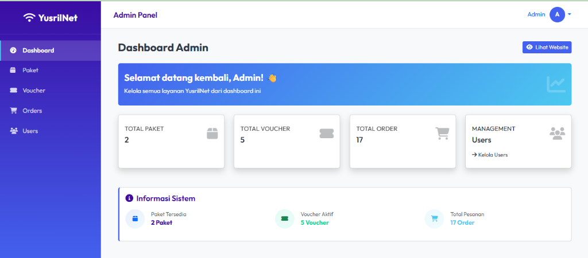
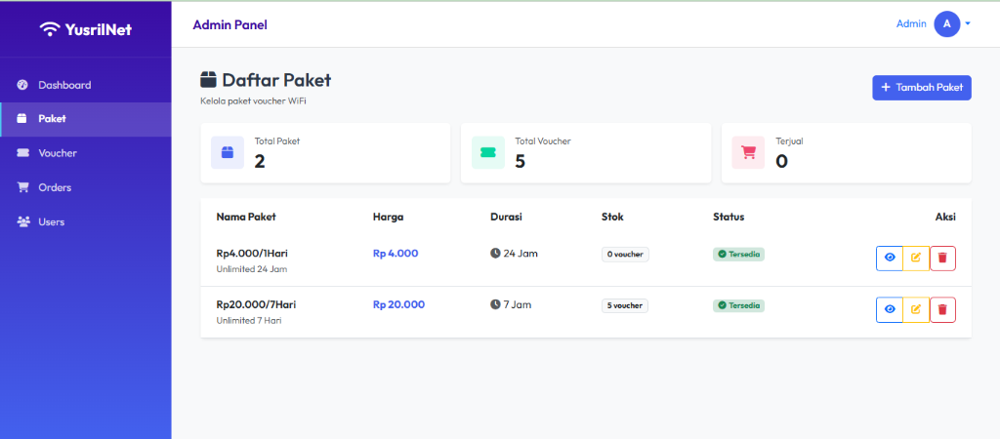
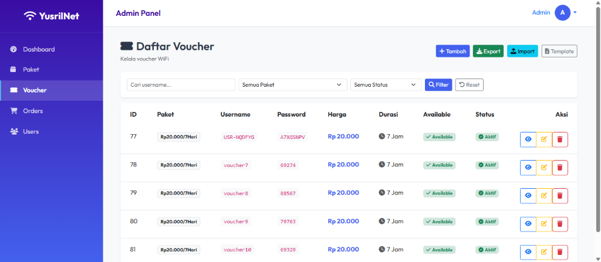
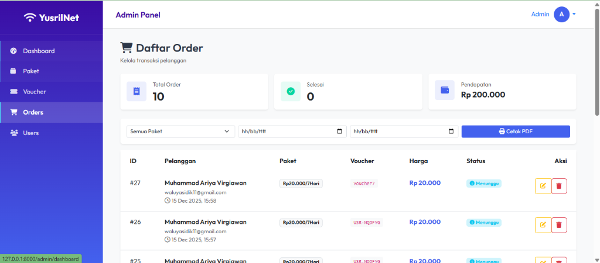
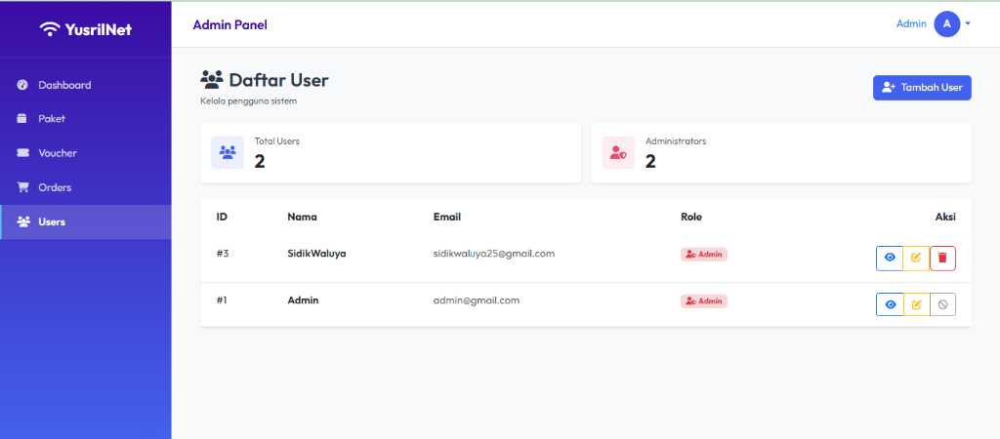
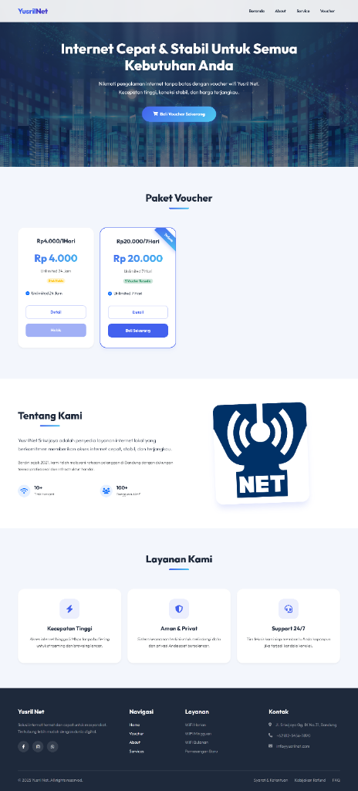
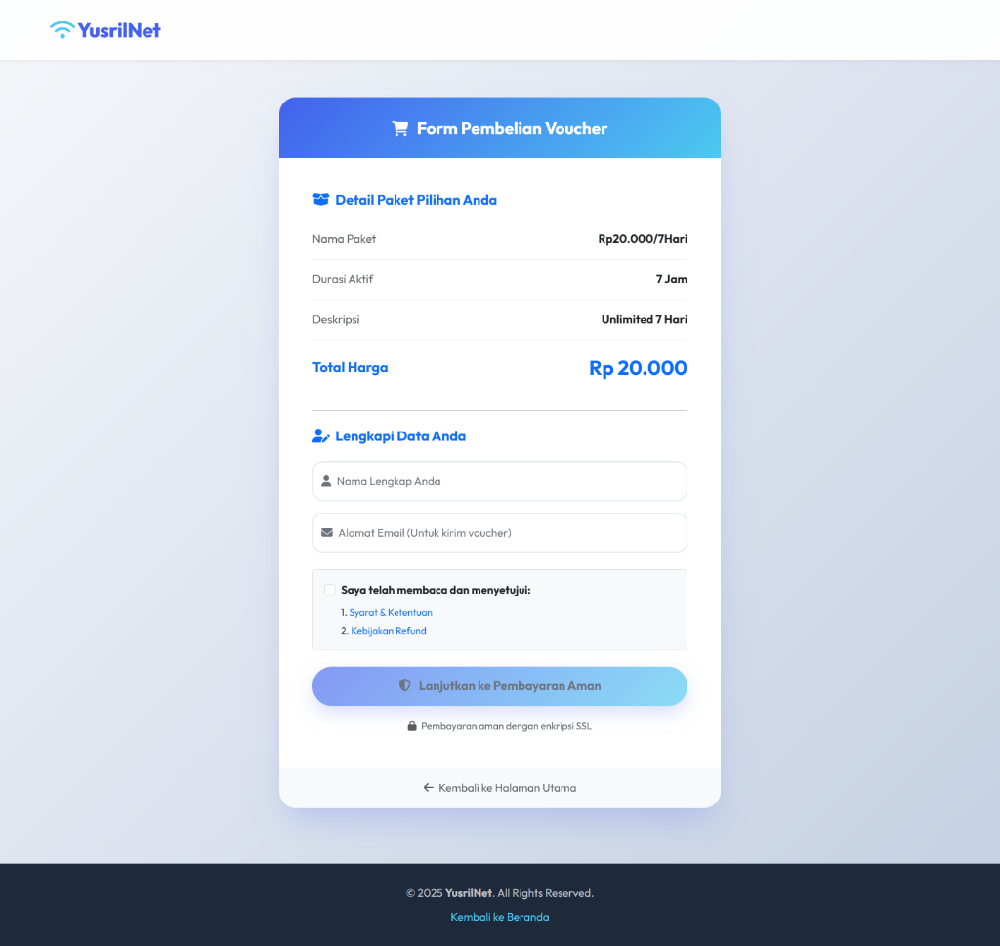
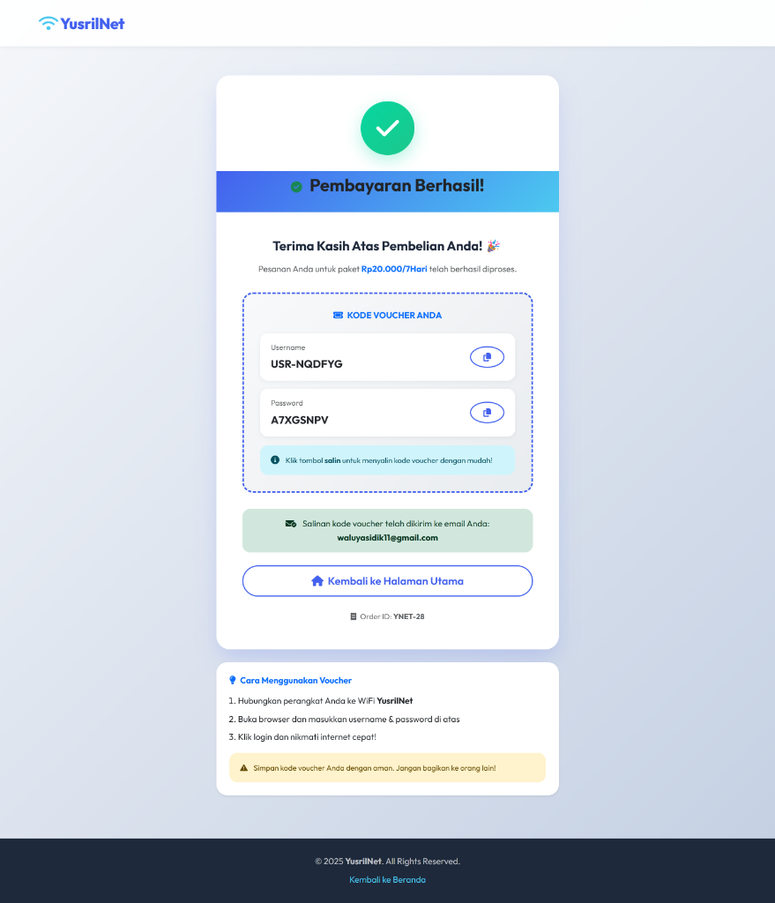

# YusrilNet - WiFi Voucher Management System


YusrilNet adalah sistem manajemen voucher WiFi berbasis web yang dibangun dengan Laravel. Sistem ini memungkinkan admin untuk mengelola paket internet, voucher, pesanan pelanggan, dan user dengan antarmuka yang modern dan responsif.

## ✨ Fitur Utama

### 🎨 Admin Panel Modern
- **Custom Layout** - Desain custom tanpa dependency SB Admin 2
- **Neptune Blue Theme** - Tema konsisten dengan warna biru neptune (#4361ee)
- **Fully Responsive** - Optimal di semua perangkat (desktop, tablet, mobile)
- **Clean & Minimalist** - Desain yang elegan dan mudah digunakan

### 📦 Manajemen Paket
- CRUD paket internet lengkap
- Detail paket dengan durasi dan harga
- Status ketersediaan paket
- Statistik voucher per paket

### 🎫 Manajemen Voucher
- Generate voucher otomatis
- Import/Export voucher (Excel)
- Template download untuk import
- Filter berdasarkan paket dan status
- Bulk actions (hapus semua, hapus berdasarkan filter)

### 🛒 Manajemen Orders
- Tracking pesanan pelanggan
- Integrasi payment gateway (iPaymu)
- Filter dan cetak laporan PDF
- Status pesanan (pending, terkirim, selesai, batal)

### 👥 Manajemen User
- User management dengan role (Admin/User)
- Email verification
- Password management
- Proteksi hapus diri sendiri

### 🌍 Public Interface
- **Homepage Modern** - Landing page dengan daftar paket
- **Pembelian Voucher** - Form checkout yang user-friendly
- **Payment Gateway** - Integrasi iPaymu untuk pembayaran
- **Email Notification** - Voucher otomatis dikirim ke email
- **Responsive Design** - Optimal di semua perangkat


## 📸 Screenshots

### Dashboard Admin

*Dashboard dengan statistik dan informasi sistem*

### Manajemen Paket

*Kelola paket internet dengan mudah*

### Manajemen Voucher

*Generate dan kelola voucher WiFi*

### Manajemen Orders

*Tracking pesanan pelanggan*

### Manajemen Users

*Kelola pengguna sistem*

## 🌐 User Interface (Public)

### Homepage

*Halaman utama dengan daftar paket voucher WiFi*

### Form Pembelian

*Form pembelian voucher dengan integrasi payment gateway*

### Halaman Sukses

*Halaman konfirmasi pembelian dengan kode voucher*


## 🚀 Teknologi

- **Framework**: Laravel 11.x
- **PHP**: 8.2+
- **Database**: MySQL
- **Frontend**: 
  - Bootstrap 5.3
  - Font Awesome 6
  - Custom CSS
- **Payment**: iPaymu Gateway
- **Export/Import**: Maatwebsite Excel

## 📋 Persyaratan Sistem

- PHP >= 8.2
- Composer
- MySQL >= 5.7
- Node.js & NPM (untuk asset compilation)
- Web Server (Apache/Nginx)

## 🔧 Instalasi

1. **Clone Repository**
   ```bash
   git clone https://github.com/SidikWaluyaa/YusrilNet.git
   cd YusrilNet
   ```

2. **Install Dependencies**
   ```bash
   composer install
   npm install
   ```

3. **Environment Setup**
   ```bash
   cp .env.example .env
   php artisan key:generate
   ```

4. **Database Configuration**
   
   Edit file `.env` dan sesuaikan konfigurasi database:
   ```env
   DB_CONNECTION=mysql
   DB_HOST=127.0.0.1
   DB_PORT=3306
   DB_DATABASE=sidiknet
   DB_USERNAME=root
   DB_PASSWORD=
   ```

5. **Run Migration & Seeder**
   ```bash
   php artisan migrate --seed
   ```

6. **Compile Assets**
   ```bash
   npm run dev
   # atau untuk production
   npm run build
   ```

7. **Run Application**
   ```bash
   php artisan serve
   ```

8. **Access Application**
   
   Buka browser dan akses: `http://localhost:8000`

## 👤 Default Login

**Admin Account:**
- Email: `admin@gmail.com`
- Password: `password`

## 📁 Struktur Project

```
YusrilNet/
├── app/
│   ├── Http/Controllers/
│   │   ├── AdminController.php
│   │   ├── PaketController.php
│   │   ├── VoucherController.php
│   │   ├── OrderController.php
│   │   └── UserController.php
│   └── Models/
│       ├── Paket.php
│       ├── Voucher.php
│       ├── Order.php
│       └── User.php
├── resources/
│   └── views/
│       ├── layouts/
│       │   └── app.blade.php (Custom Admin Layout)
│       ├── admin/
│       ├── pakets/
│       ├── vouchers/
│       ├── orders/
│       └── users/
├── routes/
│   └── web.php
└── database/
    └── migrations/
```

## 🎨 Design System

### Color Palette
- **Primary (Neptune Blue)**: `#4361ee`
- **Neptune Dark**: `#3a0ca3`
- **Neptune Light**: `#4cc9f0`
- **Success**: `#06d6a0`
- **Warning**: `#ffd60a`
- **Danger**: `#ef476f`
- **Text Dark**: `#2d3748`

### Components
- **Stats Cards**: Rounded icons dengan background subtle
- **Tables**: Clean headers dengan hover effects
- **Forms**: Simple inputs dengan clear labels
- **Buttons**: Outline style untuk actions
- **Badges**: Subtle colors dengan icons

## 🔐 Fitur Keamanan

- Authentication dengan Laravel Breeze
- Role-based access control (Admin/User)
- CSRF Protection
- Password hashing dengan bcrypt
- Email verification
- Protected routes dengan middleware

## 📝 API Integration

### iPaymu Payment Gateway
Sistem terintegrasi dengan iPaymu untuk payment processing:
- Automatic payment redirect
- Callback handling
- Transaction verification

## 🤝 Kontribusi

Kontribusi selalu diterima! Silakan:
1. Fork repository ini
2. Buat branch fitur (`git checkout -b feature/AmazingFeature`)
3. Commit perubahan (`git commit -m 'Add some AmazingFeature'`)
4. Push ke branch (`git push origin feature/AmazingFeature`)
5. Buat Pull Request

## 📄 License

Project ini dilisensikan di bawah [MIT License](LICENSE).

## 👨‍💻 Developer

**Sidik Waluya**
- GitHub: [@SidikWaluyaa](https://github.com/SidikWaluyaa)
- Email: sidikwaluya25@gmail.com

## 🙏 Acknowledgments

- Laravel Framework
- Bootstrap
- Font Awesome
- iPaymu Payment Gateway
- Maatwebsite Excel

---

⭐ Jika project ini membantu, jangan lupa berikan star!
